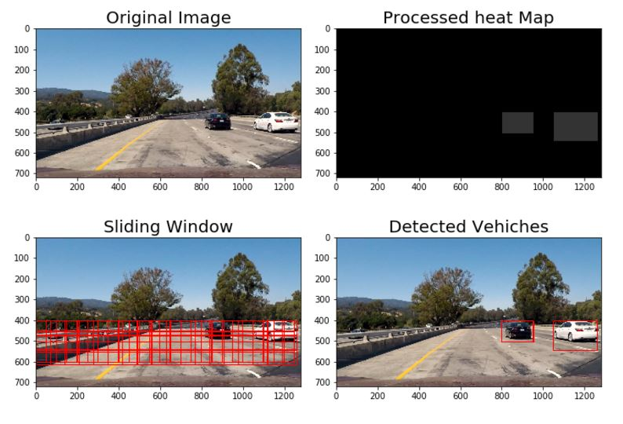

# Vehicle Detection and Tracking
- by NK Zou

The goals / steps of this project are the following:

* Perform a Histogram of Oriented Gradients (HOG) feature extraction on a labeled training set of images and train a classifier Linear SVM classifier
* Optionally, you can also apply a color transform and append binned color features, as well as histograms of color, to your HOG feature vector. 
* Note: for those first two steps don't forget to normalize your features and randomize a selection for training and testing.
* Implement a sliding-window technique and use your trained classifier to search for vehicles in images.
* Run your pipeline on a video stream and create a heat map of recurring detections frame by frame to reject outliers and follow detected vehicles.
* Estimate a bounding box for vehicles detected.

---

# Rubric Points
  
### 1- Writeup / README
#### Provide a Writeup / README that includes all the rubric points and how you addressed each one.
  
This is a writeup document.  
  
  
### 2- Histogram of Oriented Gradients (HOG)
### 2.1- Explain how (and identify where in your code) you extracted HOG features from the training images.
#### Explanation given for methods used to extract HOG features, including which color space was chosen, which HOG parameters (orientations, pixels_per_cell, cells_per_block), and why.
  
1) The code for this step is contained in the first code cell of the IPython notebook located in Advanced_Lane_Finding.ipynb [section 1].  
2) I explored different color spaces and different parameters of the hog, includes orientations, pixels_per_cell, and cells_per_block.  
* I have extracted features used 3 different methods, HOG spends more time than histogram and spatial. But we need to combine the methods to compute an accurate prediction as well being able to do it fast.  
* I tried different combinations of extraction methods access a variety of color spaces and varying the channels used for HOG. According to the results, we can see that the HSV _spa_hist_hog2 have higher accuracy and lesser time.  
* I tried various of parameters, changing orientations with 6, 9 and 12. According to the test result of the effect on the performance of the SVM prediction,  9 better than other numbers.  
* I also tried pixels_per_cell with 8 or 16,  combined with the cells_per_block with 2 or 4. 8 pixels_per_cell with 2 cells_per_block has better accuracy.  
* I decided to use HSV color space and HOG parameters with orientations=9, pixels_per_cell=(8, 8), cells_per_block=(2, 2) in this project.  
  
### 2.2- Describe how (and identify where in your code) you trained a classifier using your selected HOG features (and color features if you used them).
#### The HOG features extracted from the training data have been used to train a classifier, could be SVM, Decision Tree or other. Features should be scaled to zero mean and unit variance before training the classifier.
  
1) The code for this step is contained in the first code cell of the IPython notebook located in Advanced_Lane_Finding.ipynb [section 1].  
2) I extracted spatial, histogram and HOG features from the train data, then use StandardScaler to scaled features to zero mean and unit variance, and used SVM to train the classifier.  
  
  
### 3- Sliding Window Search
### 3.1- Describe how (and identify where in your code) you implemented a sliding window search. How did you decide what scales to search and how much to overlap windows?
#### A sliding window approach has been implemented, where overlapping tiles in each test image are classified as vehicle or non-vehicle. Some justification has been given for the particular implementation chosen.
  
1) The code for this step is contained in the first code cell of the IPython notebook located in Advanced_Lane_Finding.ipynb [section 2.1] and [section 2.2].  
2) We only detect vehicles on the middle of the image, neither top of the bottom, because almost is the horizon, sky, mountain and distant vehicles on the upper part, our vehicle's dashboard or hood on the lower part.  
3) We also need to calculate the number of windows and the size of the window with overlap, 1/2 of overlap is a better parameter, but max 3 rows of different size of squares, it will keep a total number of rectangles less than 150, shall save time to detect vehicles in the single image.  
  
### 3.2- Show some examples of test images to demonstrate how your pipeline is working. How did you optimize the performance of your classifier?
#### Some discussion is given around how you improved the reliability of the classifier i.e., fewer false positives and more reliable car detections (this could be things like choice of feature vector, thresholding the decision function, hard negative mining etc.)
  
* Use VideoFileClip to take images from video.  
* Create rectangles via slide window and search them.  
* Classify data and convert the positive result to the heat map.  
* Filter heat map and keep strongest signals.  
* Keep heat map state from iteration to iteration with 5% of decay.  
* Combine heat map in a ratio of 0.2 and 0.8.  
  
  
### 4- Video Implementation
### 4.1- Provide a link to your final video output. Your pipeline should perform reasonably well on the entire project video (somewhat wobbly or unstable bounding boxes are ok as long as you are identifying the vehicles most of the time with minimal false positives.)
#### The sliding-window search plus classifier has been used to search for and identify vehicles in the videos provided. Video output has been generated with detected vehicle positions drawn (bounding boxes, circles, cubes, etc.) on each frame of video.
  
[Completed Project Video](https://twitter.com/samurai_robot/status/830292963829821440)   
  
### 4.2- Describe how (and identify where in your code) you implemented some kind of filter for false positives and some method for combining overlapping bounding boxes.
#### A method, such as requiring that a detection be found at or near the same position in several subsequent frames, (could be a heat map showing the location of repeat detections) is implemented as a means of rejecting false positives, and this demonstrably reduces the number of false positives. Same or similar method used to draw bounding boxes (or circles, cubes, etc.) around high-confidence detections where multiple overlapping detections occur.
  
1) The details of code for this step is contained in the first code cell of the IPython notebook located in Advanced_Lane_Finding.ipynb [section 2.2].  
2) Used openCV to merge overlaps, computed valid areas and centroids, created the bound box.  
* Keep heat map state from iteration to iteration with 5% of decay.  
* Detect positive and create a new heat_map.  
* Filter the new heat map and keep valid area data, then eliminate false positives from the new heat map.  
* Filter the new heat_map again and keep all of the detected areas.  
* Combine all of the heat maps with a ratio of 0.2 and 0.8.  
* Detect vehicles by combined heat map.  
  
### 5- Discussion
### Briefly discuss any problems / issues you faced in your implementation of this project. Where will your pipeline likely fail? What could you do to make it more robust?
#### Discussion includes some consideration of problems/issues faced, what could be improved about their algorithm/pipeline, and what hypothetical cases would cause their pipeline to fail.
  
* This project can detect vehicles in most of the time but still will miss objects or detect wrong objects in sometimes.  
* One of the reason is the classifier still get many false positives, especially around the left fences, I guess it can be confusing with vehicles images since the vertical lines of the fences.  
* I can reduce the number of false positive by setting a threshold on the heat map, but we still miss some frame in sometimes, since moving average method that is used to update the position of the bounding box also delay, like we can see the bounding box is lagged behind the vehicle.  
* Maybe I can tune the parameters of threshold and moving average to filter the false positives without miss true positives and delay. I will try it in the future.  
* I think deep learning is a better way to classification, it might expect higher accuracy.  